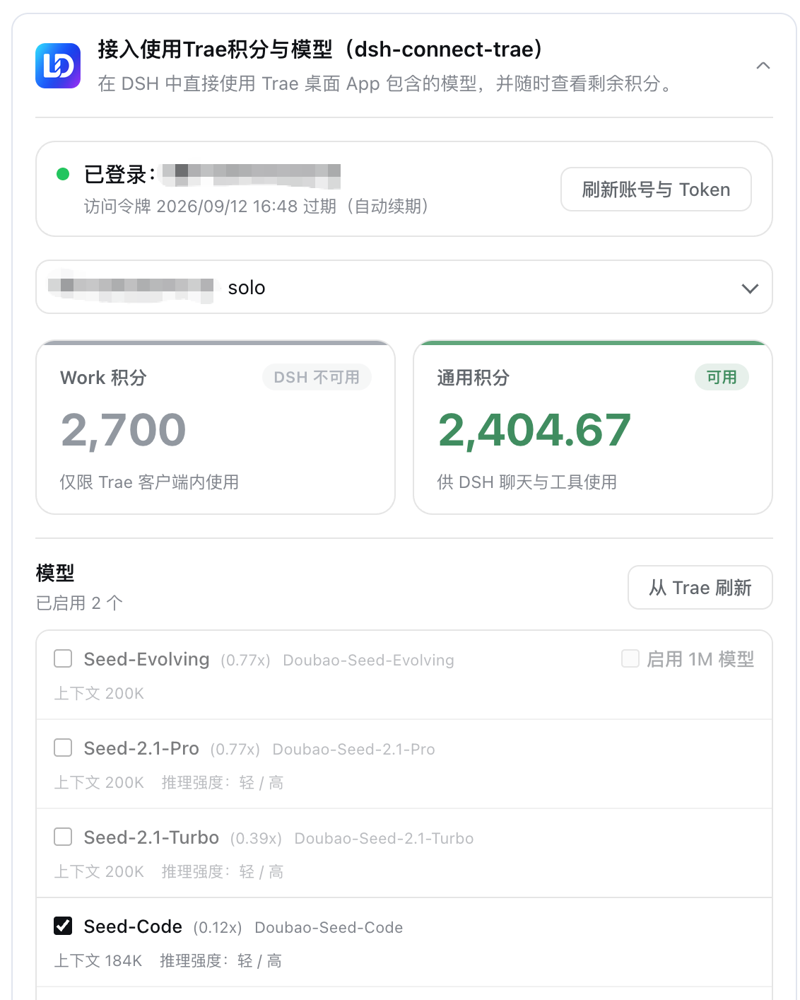

<p align="center">
  
</p>

<h1 align="center">dsh-connect-trae</h1>

<p align="center"><b>Connect locally signed-in Trae models to DeepSeek Harness with local DSH tools and a read-only credits overview.</b></p>

<p align="center">
  <a href="README.md">中文</a> ·
  <a href="#install">Install</a> ·
  <a href="#how-it-works">How it works</a> ·
  <a href="CHANGELOG.md">Changelog</a> ·
  <a href="https://github.com/dingminhua/dsh-connect-trae/issues">Issues</a>
</p>

<p align="center">
  <a href="https://www.npmjs.com/package/dsh-connect-trae"></a>
  <a href="https://www.npmjs.com/package/dsh-connect-trae"></a>
  <a href="https://github.com/dingminhua/dsh-connect-trae/actions/workflows/ci.yml"></a>
  <a href="LICENSE"></a>
  <a href="https://github.com/dingminhua/dsh-connect-trae/stargazers"></a>
  <a href="https://dshfind.com/plugins/dingminhua/dsh-connect-trae"></a>
</p>

A [DeepSeek Harness (DSH)](https://github.com/deepseek-ai/deepseek-harness) bundle plugin that connects locally signed-in Trae CN models to the DSH model picker. Trae generates structured tool calls while DSH executes its own local tools, with a read-only Work/general credits and model-management panel.

## Features

- **Trae model provider** — registers locally signed-in Trae models as the `trae` provider (e.g. `DeepSeek-V4-Flash`, `DeepSeek-V4-Pro`).
- **Multiplier in the model name** — model names show the credit multiplier in Trae's own menu format (e.g. `GLM-5.2 · x0.79`), updated with each directory refresh.
- **DSH local tool loop** — gets pending structured `tool_calls` from Trae `llm_utils_chat`, lets DSH execute its own local tools, then returns tool results to the model.
- **Trae CN account switching** — detects local Trae CN and TRAE SOLO CN sign-ins, refreshes the token list, and lets users select an account without storing tokens in DSH settings.
- **Read-only credits and model management** — shows Work credits separately from the general credits usable by DSH, and manages which Trae models are enabled. Read-only queries do not consume credits.
- **Secure loopback shim** — random port + in-process random secret; the real Trae token is never handed to pi-ai.

## How it works

```text
DSH PiAiAdapter
  -> secure loopback shim
  -> TraeSoloBridge
  -> https://trae-api-cn.mchost.guru/api/agent/v3/llm_utils_chat
  -> Trae SSE / pending function_call
  -> OpenAI SSE tool_calls
  -> DSH executes local tools and returns their results
```

Usage overview hits the read-only `https://api.trae.cn/trae/api/v2/pay/*` and `/trae/api/v2/ug/*` endpoints.

> See `docs/IMPLEMENTATION_PLAN.md`, `docs/SOLO_ROUTE_DECISION.md`, `docs/USAGE_API_RESEARCH.md`.

## Install

```sh
dsh plugin --profile desktop add dsh-connect-trae
```

Or directly via npm:

```sh
npm install dsh-connect-trae
```

Restart the DSH process after install/update/uninstall.

## Windows notes

- **Account data directory**: the plugin reads `%APPDATA%\Trae CN` / `%APPDATA%\TRAE SOLO CN` → `User\globalStorage\storage.json` (unrelated to the install directory). The folder names match macOS, so no extra config is needed; if the name does not match, point the `authFile` + `edition` plugin options at the exact path.
- **App version headers**: the plugin reads `appVersion` from `<LOCALAPPDATA>\Programs\<AppName>\resources\app\product.json` and sends `x-app-version` / `x-ide-version`; if unreadable, those headers are omitted (same as the previous behavior).
- **Raw Chat probing (known limitation)**: `model-cache` depends on the `sqlite3` command-line tool, which is not installed by default on Windows; Raw Chat capability probing fails and falls back safely. Raw Chat is off by default and does not affect the main flow.
- See `docs/WINDOWS_TOKEN_PROBE.md` for troubleshooting.

## Development

```sh
pnpm install
pnpm run check   # typecheck + test + build
```

Local dev via a `link:` install to the desktop profile (restart DSH Desktop after editing):

```sh
dsh plugin --profile desktop add /Users/dmh2002/DshProject/dsh-connect-trae
```

## Acknowledgements

- [Wang-JQ77/dsh-trae-api](https://github.com/Wang-JQ77/dsh-trae-api) (MIT) — Reference implementation for research into Trae authentication, sessions, and model protocols.

## Third-party open-source dependencies

The open-source projects referenced for Trae integration (architecture/protocol research), together with their licenses and compliance notes, are recorded in [THIRD_PARTY_NOTICES.md](THIRD_PARTY_NOTICES.md). When introducing new Trae-related external dependencies or reusing code from other projects, update that file accordingly and honor the upstream licenses.

## License

This project is licensed under the [MIT License](LICENSE). Copyright: **Copyright (c) 2026 LaoDing**.
